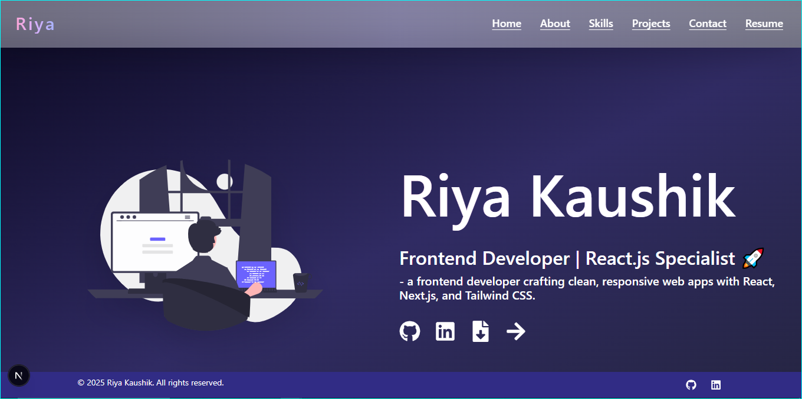

<h1 align="center">🚀 Riya's Portfolio</h1>

<p align="center">
  <b>Frontend Developer Portfolio</b> <br/>
  Built with ❤️ using <code>Next.js</code> + <code>Tailwind CSS</code>
</p>

<p align="center">
  
  
  
</p>

---

## ✨ Live Demo

🚀 *[View Live ](https://riya-kaushik-portfolio.vercel.app/)*

---

## 📸 Screenshots


 
---

## 🔥 Features

✅ Animated Hero section with gradient heading  
✅ Count-up animation showing 20+ Projects & 10+ Skills  
✅ Interactive gradient text component  
✅ Beautiful full-screen loader  
✅ Fully responsive & mobile friendly  
✅ Modern glassmorphism effects  

---

## 🚀 Tech Stack

- ⚡ *Next.js* (App Router)
- 🎨 *Tailwind CSS*
- ⚛️ *React Hooks*
- ✨ *Framer Motion / Custom Animations*
- 🌀 *react-loading-indicators*

---

## 📂 Folder Structure

components/ │   ├── GradientText.jsx │   ├── Loader.jsx │   └── StatsCounter.jsx pages/ │   ├── index.jsx │   └── my_resume.jsx public/ │   └── resume.pdf

---

## 🛠 Setup & Run

```bash
# Install dependencies
bun install 
# or npm install

# Start local dev server
bun dev
# or npm run dev

# Visit localhost
http://localhost:3000


---

✍️ Author

💁‍♀️ Riya Kaushik
🎨 Frontend Developer specializing in ReactJS & TailwindCSS
📫 Connect on LinkedIn (replace with your link)


---

⭐ Show some ❤️

If you like it, star the repo and share with friends!